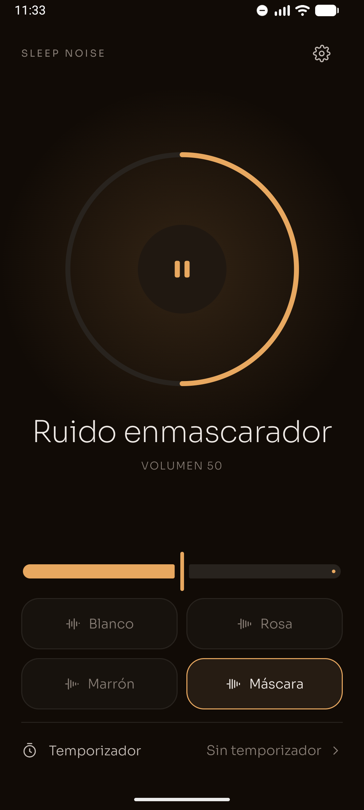
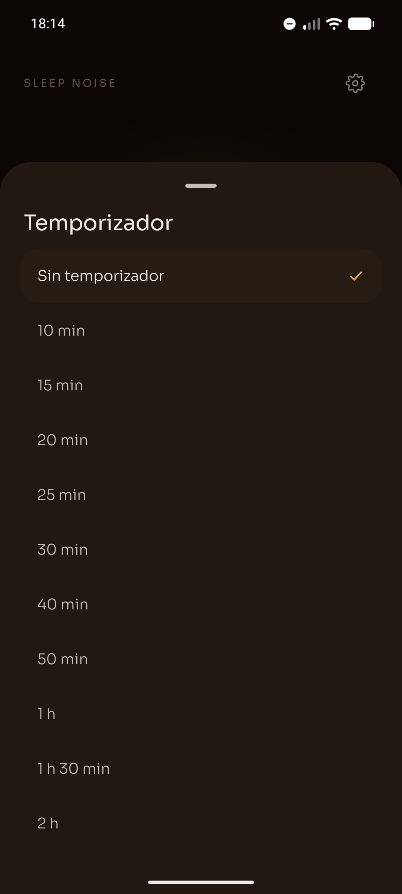
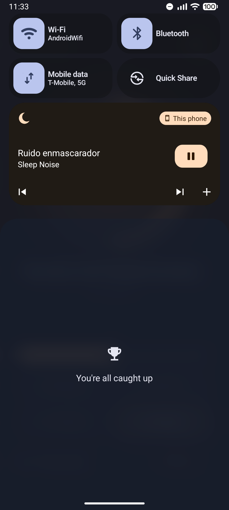
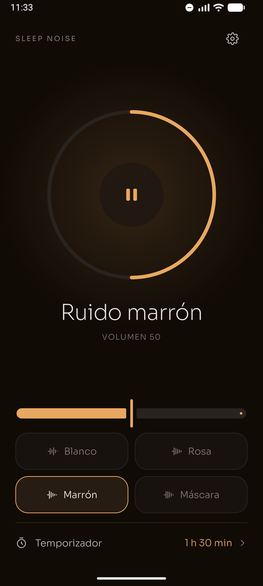

# Sleep Noise para Android

<p align="center">
  <a href="README.md">English</a> · <strong>Español</strong>
</p>

<p align="center">
  
</p>

<p align="center">
  <strong>Ruido para dormir, o para tapar el ruido de alrededor. Se abre y suena: no hay que pulsar nada.</strong>
</p>

<p align="center">
  
  
  
  
  
  
</p>

<p align="center">
  <a href="https://play.google.com/store/apps/details?id=com.jjrapps.sleepnoise">
    
  </a>
</p>

<p align="center">
  <br />
  <sub>Escanea el código con el móvil para ir directo a la ficha.</sub>
</p>

---

## Qué es

**Sleep Noise** genera ruido de fondo continuo con **dos propósitos que pesan igual**:

- **Dormirse.** Un ruido estable que tapa los golpes y las voces que despiertan de madrugada.
- **Tapar el ruido de alrededor cuando no puedes irte de donde estás.** Con auriculares, y a veces
  con tapones debajo, en un sitio donde hay gente hablando o trabajando.

Sin bienvenida, sin cuentas, sin anuncios y sin internet. Abrir la app ya es escuchar.

<p align="center">
  
  
  
  
</p>

---

## ✨ Funciones

### 🎧 Cuatro sonidos, y ni uno más

No hay catálogo que recorrer ni mezclas que configurar a las dos de la mañana: cada uno hace algo
distinto.

| Sonido | Para qué sirve |
| :--- | :--- |
| **Enmascarador** (el que viene puesto) | Tapar conversaciones: pone el **71 %** de su energía en la banda donde vive la voz, frente al 9 % del marrón |
| **Rosa** | El equilibrado: la misma energía en cada octava, el que el oído percibe como más natural |
| **Blanco** | Plano en todo el espectro. Tapa bien los ruidos agudos y secos |
| **Marrón** | Grave y envolvente, como lluvia lejana. El más cómodo para dormir |

### 🔊 Generado, no grabado

El ruido se sintetiza en el teléfono, muestra a muestra, mientras suena. No hay un bucle que se
repita y acabes notando, ni la textura metálica que deja el audio comprimido. Suena igual de limpio
la primera hora que la octava.

### ⏲️ Temporizador con apagado progresivo

- De cinco en cinco hasta la media hora, de diez en diez hasta la hora, y 90 o 120 minutos.
- El volumen baja poco a poco durante el último minuto: un corte seco despierta a quien justo se
  estaba durmiendo.
- Se pueden añadir diez minutos desde la notificación.

### 🔕 No molestar mientras suena

- Activa No molestar al empezar el ruido y lo desactiva al parar.
- **Las alarmas siguen pasando**: respeta las excepciones que ya tengas.
- Solo devuelve el silencio que puso ella: nunca apaga un No molestar que activaste tú.
- Se desactiva en Ajustes si prefieres que no lo toque.

### 📱 Se controla sin abrir la app

- Notificación de medios para pausar, cambiar de sonido y alargar el temporizador.
- Funciona el botón de los auriculares.
- Sigue sonando con la app cerrada y la pantalla apagada.
- Al desenchufar los auriculares se pausa, para que no suene por el altavoz a las cuatro de la mañana.

### 🌙 Oscura siempre

No hay modo claro, y no es un olvido: la app se usa en la cama con la luz apagada, y una pantalla
blanca ahí deslumbra. Un solo color de acento, ámbar, sobre grises cálidos.

### 🌐 Español e inglés

Sigue el idioma del sistema, con inglés para cualquier otro idioma, y se puede cambiar desde Ajustes.

### 🔒 Privada por diseño

- La app **no pide el permiso de internet**: no puede conectarse aunque quisiera.
- Sin cuentas, sin nube, sin anuncios, sin analítica y sin seguimiento.
- [Política de privacidad](https://jorgejiro.es/apps/sleep-noise/privacidad/)

---

## 📲 Instalación

### Desde Google Play (recomendado)

<a href="https://play.google.com/store/apps/details?id=com.jjrapps.sleepnoise">
  
</a>

Instálala desde [la ficha de Google Play](https://play.google.com/store/apps/details?id=com.jjrapps.sleepnoise)
o escaneando el código QR de arriba. Así recibes las actualizaciones automáticamente.

### APK desde GitHub

Las versiones de validación se publican con su APK firmado en
[Releases](https://github.com/jorgejiro/sleep-noise-android/releases).

1. Descarga el `.apk` de la última release en el móvil.
2. Permite **Instalar aplicaciones desconocidas** para el navegador o el gestor de archivos.
3. Abre el `.apk` y pulsa **Instalar**.

O desde el ordenador:

```bash
adb install sleep-noise-<versión>.apk
```

### Requisitos

| | |
| :--- | :--- |
| Android | 12 o superior (API 31) |
| Permisos | Notificaciones y, opcionalmente, acceso a No molestar |
| Conexión | Ninguna |

---

## 🛠️ Stack técnico

| Capa | Tecnología |
| :--- | :--- |
| Lenguaje | Kotlin 2.4 |
| UI | Jetpack Compose + Material 3 Expressive, tema oscuro único |
| Audio | Media3 1.11 (ExoPlayer + `MediaSessionService`) con síntesis procedural propia |
| Arquitectura | MVVM + UDF, capas `ui` / `domain` / `data` |
| DI | Hilt (con KSP) |
| Persistencia | DataStore Preferences |
| Concurrencia | Coroutines + Flow |
| Tests | JUnit 4, MockK, Turbine, Compose UI Test |

El porqué de cada decisión está en los [ADR](docs/decisions/). El más importante para entender el
producto es el [006](docs/decisions/006-nivel-y-ruidos-de-enmascaramiento.md).

---

## 🚀 Compilar desde el código

### Requisitos previos

- JDK 21 (el daemon de Gradle lo descarga si falta).
- Android SDK con `compileSdk` 37.

### Clonar y compilar

```bash
git clone https://github.com/jorgejiro/sleep-noise-android.git
cd sleep-noise-android

# APK de depuración
./gradlew assembleDebug

# Lint y tests
./gradlew lint test
```

El APK queda en `app/build/outputs/apk/debug/`. El build de release necesita un keystore propio, que
no está en el repositorio.

---

## 📂 Estructura del proyecto

```text
├── app/src/main/java/com/jjrapps/sleepnoise/
│   ├── audio/        # Síntesis de ruido: matemática pura, sin Android, testeada en JVM
│   ├── playback/     # MediaSessionService, fades, temporizador y No molestar
│   ├── data/         # DataStore y repositorios
│   ├── domain/       # Modelos y contratos
│   ├── di/           # Módulos de Hilt
│   └── ui/           # Pantallas Compose: player, timer, settings, changelog y tema
├── docs/
│   ├── decisions/    # ADR
│   ├── design/       # Mockups e icono
│   └── store-assets/ # Capturas y gráficos de la ficha de Play
├── scripts/          # Generadores del icono y de los textos de la ficha
└── gradle/libs.versions.toml
```

---

## 📚 Documentación

- [Especificación y plan de la release 1.0](docs/especificacion-release-1.0.md)
- [Análisis técnico](docs/analisis-tecnico.md)
- [Guía de trabajo del repositorio](CLAUDE.md)
- [Decisiones de arquitectura (ADR)](docs/decisions/)
- [Icono de la app](docs/design/icono/)
- [Textos de la ficha de Google Play](docs/play-store-publication-texts.md)
- [Notas de la versión para Play](docs/play-release-notes.md)
- [Política de privacidad](https://jorgejiro.es/apps/sleep-noise/privacidad/) — el HTML vive en el
  repositorio `vps` (ver [`docs/privacy-policy/LEEME.md`](docs/privacy-policy/LEEME.md))
- [Generación de las capturas de la ficha](docs/store-assets/generar-capturas/README.md)
- [Changelog](CHANGELOG.md)

---

## 💬 Sugerencias y errores

¿Algo no suena como esperabas? Abre un [issue](https://github.com/jorgejiro/sleep-noise-android/issues)
o escribe desde **Ajustes → Enviar comentarios** dentro de la app.

Y si te ayuda a dormir, una valoración en
[Google Play](https://play.google.com/store/apps/details?id=com.jjrapps.sleepnoise) ayuda a que la
encuentre más gente.

---

## 📄 Licencia

Distribuido bajo la [licencia MIT](LICENSE).
