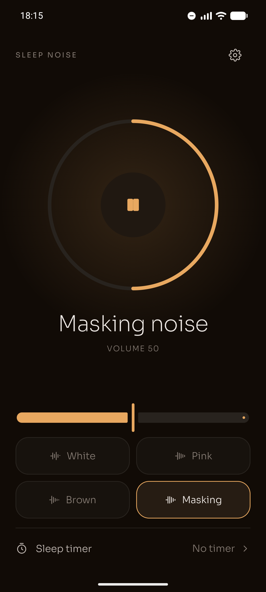
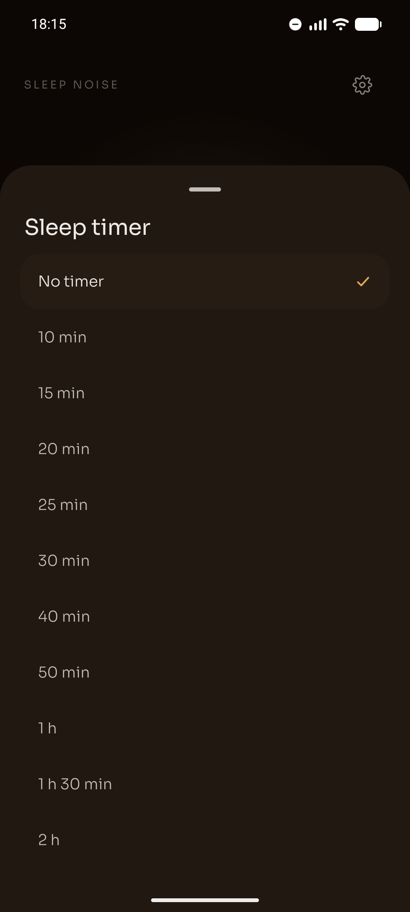
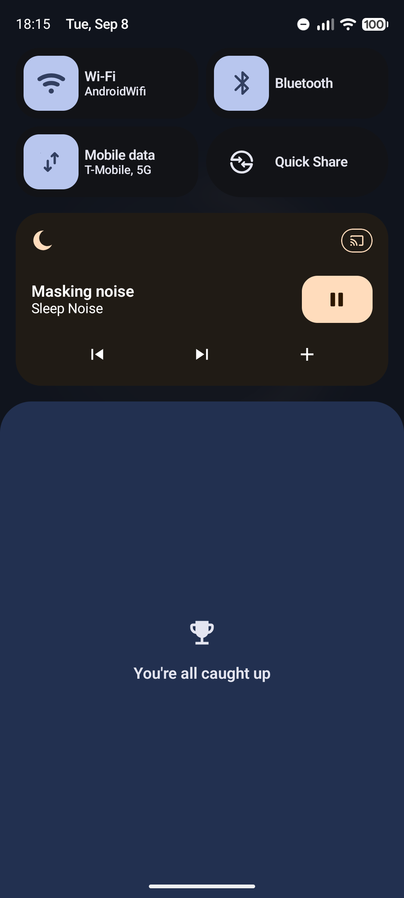
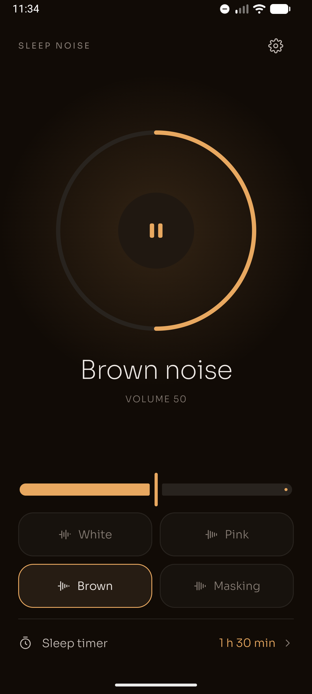

# Sleep Noise for Android

<p align="center">
  <strong>English</strong> · <a href="README.es.md">Español</a>
</p>

<p align="center">
  
</p>

<p align="center">
  <strong>Noise to sleep, or to cover the room around you. Open it and it plays — there is nothing to press.</strong>
</p>

<p align="center">
  
  
  
  
  
  
</p>

<p align="center">
  <a href="https://play.google.com/store/apps/details?id=com.jjrapps.sleepnoise">
    
  </a>
</p>

<p align="center">
  <br />
  <sub>Scan the code with your phone to go straight to the listing.</sub>
</p>

---

## What it is

**Sleep Noise** generates continuous background noise with **two purposes that weigh the same**:

- **Falling asleep.** A steady sound that covers the bangs and voices that wake you up at night.
- **Covering the noise around you when you cannot leave.** With headphones, sometimes with
  earplugs underneath, somewhere people are talking or working.

No welcome screens, no accounts, no ads and no internet. Opening the app is already listening.

<p align="center">
  
  
  
  
</p>

---

## ✨ Features

### 🎧 Four sounds, and not one more

No catalogue to scroll through, no mix to configure at two in the morning: each one does something
different.

| Sound | What it is for |
| :--- | :--- |
| **Masking** (the default) | Covering conversation: it puts **71%** of its energy in the band where speech lives, against brown noise's 9% |
| **Pink** | The balanced one: equal energy in every octave, the one hearing perceives as most natural |
| **White** | Flat across the spectrum. Good at covering sharp, sudden sounds |
| **Brown** | Deep and enveloping, like distant rain. The most comfortable for sleeping |

### 🔊 Generated, not recorded

The noise is synthesized on your phone, sample by sample, as it plays. There is no loop that repeats
until you start noticing it, and none of the metallic texture compressed audio leaves behind. It
sounds as clean in the eighth hour as in the first.

### ⏲️ Sleep timer with a gradual fade out

- In fives up to half an hour, in tens up to an hour, then 90 or 120 minutes.
- The volume fades down through the last minute: an abrupt stop wakes up the person who was finally
  falling asleep.
- Add ten more minutes straight from the notification.

### 🔕 Do Not Disturb while it plays

- Switches Do Not Disturb on when the noise starts, and off when it stops.
- **Alarms still get through**: it keeps the exceptions you already set.
- It only gives back the silence it took: it never turns off a Do Not Disturb you switched on yourself.
- Turn it off in Settings if you would rather it left your phone alone.

### 📱 Control it without opening the app

- Media notification to pause, change sound and extend the timer.
- Your headphone button works too.
- Keeps playing with the app closed and the screen off.
- Pauses when you unplug your headphones, so it never blasts from the speaker at four in the morning.

### 🌙 Dark, always

There is no light mode, and that is not an oversight: this app gets used in bed with the lights off,
and a white screen there is blinding. A single amber accent over warm greys.

### 🌐 English and Spanish

Follows the system language, falls back to English for any other language, and can be changed in
Settings.

### 🔒 Private by design

- The app **does not request the internet permission**: it could not connect if it wanted to.
- No accounts, no cloud, no ads, no analytics and no tracking.
- [Privacy policy](https://jorgejiro.es/apps/sleep-noise/privacidad/)

---

## 📲 Installation

### From Google Play (recommended)

<a href="https://play.google.com/store/apps/details?id=com.jjrapps.sleepnoise">
  
</a>

Install it from [the Google Play listing](https://play.google.com/store/apps/details?id=com.jjrapps.sleepnoise)
or by scanning the QR code above. That way you get updates automatically.

### APK from GitHub

Validation builds are published with their signed APK under
[Releases](https://github.com/jorgejiro/sleep-noise-android/releases).

1. Download the `.apk` from the latest release on your phone.
2. Allow **Install unknown apps** for your browser or file manager.
3. Open the `.apk` and tap **Install**.

Or from your computer:

```bash
adb install sleep-noise-<version>.apk
```

### Requirements

| | |
| :--- | :--- |
| Android | 12 or later (API 31) |
| Permissions | Notifications and, optionally, Do Not Disturb access |
| Connection | None |

---

## 🛠️ Tech stack

| Layer | Technology |
| :--- | :--- |
| Language | Kotlin 2.4 |
| UI | Jetpack Compose + Material 3 Expressive, single dark theme |
| Audio | Media3 1.11 (ExoPlayer + `MediaSessionService`) with custom procedural synthesis |
| Architecture | MVVM + UDF, `ui` / `domain` / `data` layers |
| DI | Hilt (with KSP) |
| Persistence | DataStore Preferences |
| Concurrency | Coroutines + Flow |
| Tests | JUnit 4, MockK, Turbine, Compose UI Test |

The reasoning behind each decision lives in the [ADRs](docs/decisions/) (in Spanish). The one that
best explains the product is [006](docs/decisions/006-nivel-y-ruidos-de-enmascaramiento.md).

---

## 🚀 Building from source

### Prerequisites

- JDK 21 (the Gradle daemon downloads it if missing).
- Android SDK with `compileSdk` 37.

### Clone & build

```bash
git clone https://github.com/jorgejiro/sleep-noise-android.git
cd sleep-noise-android

# Debug APK
./gradlew assembleDebug

# Lint and tests
./gradlew lint test
```

The APK ends up in `app/build/outputs/apk/debug/`.

### Release signing

The signing key is not in this repository. It lives in Bitwarden Secrets Manager as
`SLEEP_NOISE_KEYSTORE_B64` (the `.jks`, base64), `SLEEP_NOISE_STORE_PASSWORD`, `SLEEP_NOISE_KEY_ALIAS` and
`SLEEP_NOISE_KEY_PASSWORD`. `con-claves` injects them and the build decodes the keystore into
`app/build/signing/` (owner-only), so any machine with access to the secrets can build a release:

```bash
con-claves './gradlew :app:assembleRelease'
```

No local copy of the keystore is kept. Without those variables the build falls back to a
git-ignored `keystore.properties` at the repo root; with neither, the release APK is left unsigned
and debug builds are unaffected.

---

## 📂 Project structure

```text
├── app/src/main/java/com/jjrapps/sleepnoise/
│   ├── audio/        # Noise synthesis: pure math, no Android, tested on the JVM
│   ├── playback/     # MediaSessionService, fades, timer and Do Not Disturb
│   ├── data/         # DataStore and repositories
│   ├── domain/       # Models and contracts
│   ├── di/           # Hilt modules
│   └── ui/           # Compose screens: player, timer, settings, changelog and theme
├── docs/
│   ├── decisions/    # ADRs
│   ├── design/       # Mockups and icon
│   └── store-assets/ # Play listing screenshots and graphics
├── scripts/          # Icon and listing text generators
└── gradle/libs.versions.toml
```

---

## 📚 Documentation

The project documentation is written in Spanish.

- [Release 1.0 specification and plan](docs/especificacion-release-1.0.md)
- [Technical analysis](docs/analisis-tecnico.md)
- [Repository working guide](CLAUDE.md)
- [Architecture decision records (ADR)](docs/decisions/)
- [App icon](docs/design/icono/)
- [Google Play listing texts](docs/play-store-publication-texts.md)
- [Play release notes](docs/play-release-notes.md)
- [Privacy policy](https://jorgejiro.es/apps/sleep-noise/privacidad/) — the HTML lives in the `vps`
  repository (see [`docs/privacy-policy/LEEME.md`](docs/privacy-policy/LEEME.md))
- [Generating the listing screenshots](docs/store-assets/generar-capturas/README.md)
- [Changelog](CHANGELOG.md)

---

## 💬 Feedback & bugs

Something not sounding the way you expected? Open an [issue](https://github.com/jorgejiro/sleep-noise-android/issues)
or write from **Settings → Send feedback** inside the app.

And if it helps you sleep, a rating on
[Google Play](https://play.google.com/store/apps/details?id=com.jjrapps.sleepnoise) helps more people
find it.

---

## 📄 License

Distributed under the [MIT License](LICENSE).
